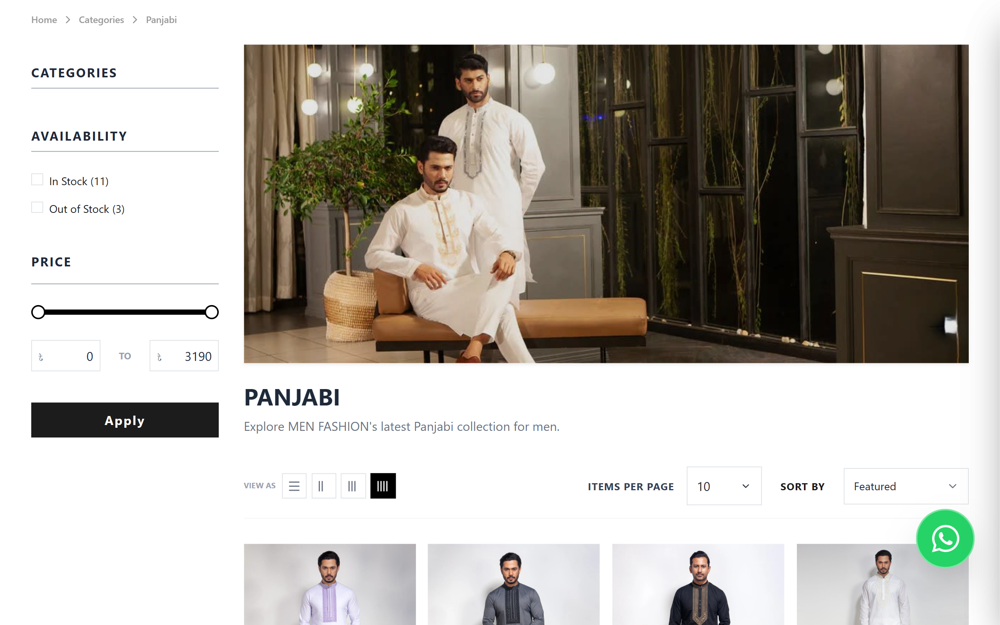
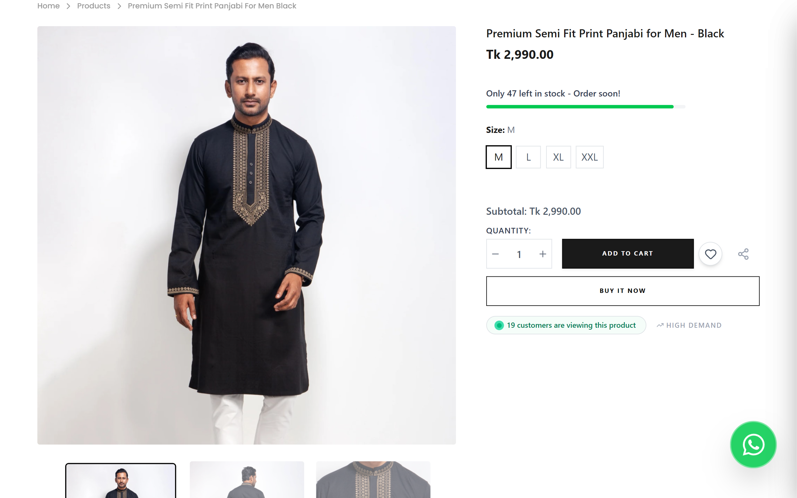
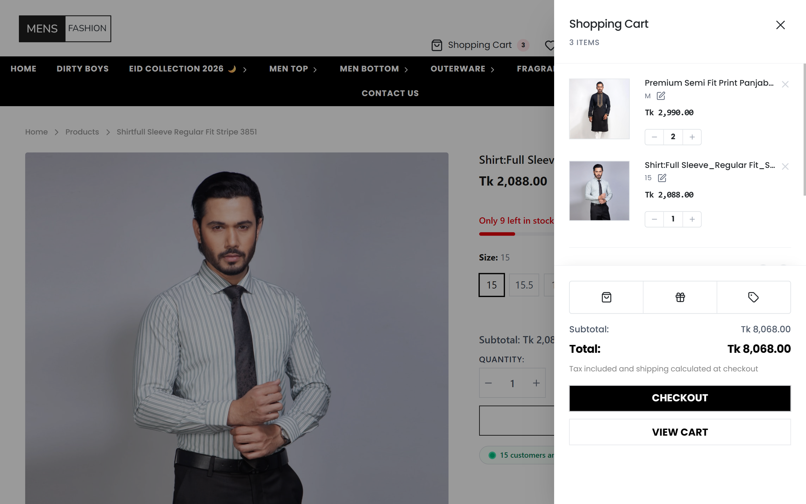
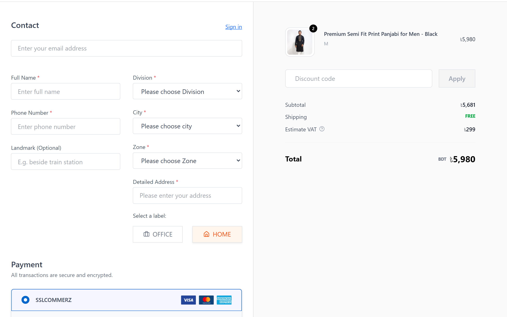
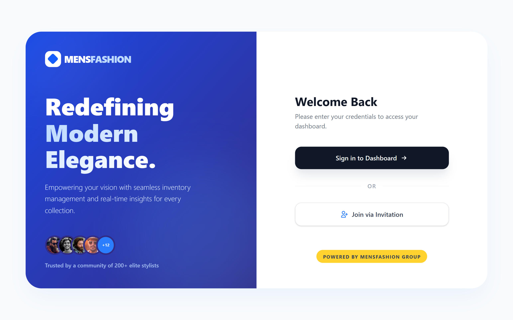
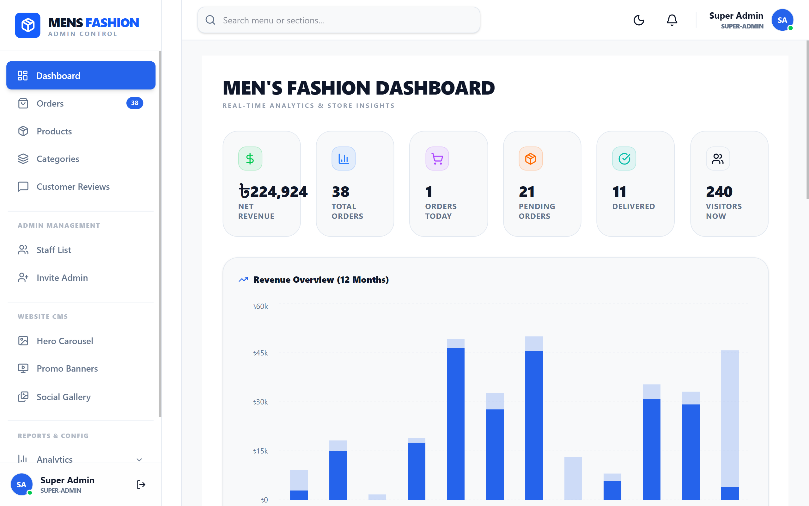
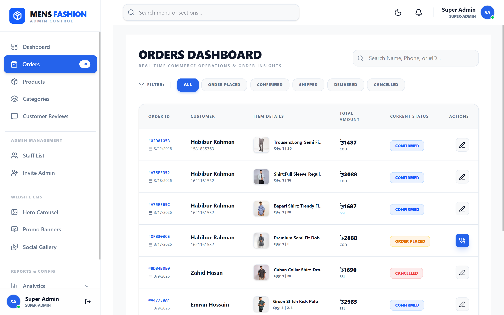
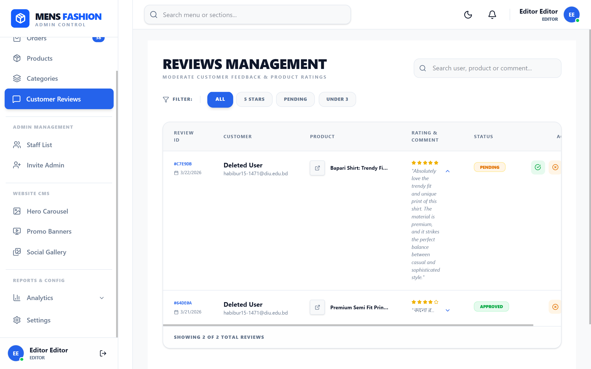

# MensFashion | High-End MERN E-Commerce Ecosystem

A production-grade, triple-tier e-commerce solution featuring a minimalist "luxury boutique" aesthetic. This ecosystem consists of a high-performance **Customer Storefront**, a comprehensive **Admin Control Panel**, and a robust **Centralized API Server**.

---

## 📑 Table of Contents

- [Project Overview](#mensfashion--high-end-mern-e-commerce-ecosystem)
- [System Architecture](#🏗-system-architecture)
- [Core Features](#✨-core-features)
- [Project Showcases](#-project-showcases)
- [Tech Stack](#🛠-tech-stack)
- [🔑 Key API Endpoints](#-key-api-endpoints-brief)
- [Project Structure](#📂-project-structure-industry-standard)
- [⚡ Performance & Security](#-performance--security)
- [Development Setup](#⚙️-development-setup)
- [Key Learning Milestones](#🚀-key-learning-milestones)

## 🏗 System Architecture

The project is architected into three independent services for maximum scalability:

1.  **Frontend (Client):** Fully responsive high-end user interface with real-time product discovery. Optimized for all screen sizes (Mobile, Tablet, Desktop).
2.  **Admin (Dashboard):** Role-based management system featuring **Dynamic Theme Support (Dark & Light Mode)** optimized for desktop-heavy administrative tasks.
3.  **Server (API):** Modular Node/Express backend with feature-based architecture for seamless data flow.

## ✨ Core Features

### 🛍 Customer Experience

- **Modern UI/UX:** Minimalist design focusing on "editorial" product presentation using **Tailwind CSS v4**.
- **Advanced Discovery:** Dynamic search overlays, hierarchical category filtering, and multi-criteria sorting.
- **Interactive Cart:** Slide-out **Cart Drawer** for quick quantity adjustments and real-time total calculation.
- **Personalized Wishlist:** Dedicated space for users to save and track their favorite items for future purchase.
- **Hybrid Authentication:** Secure login via Email/Password (JWT), Google OAuth, and GitHub Auth.
- **Seamless Checkout:** Supports both **Guest Checkout** and Registered user flows with **SSLCommerz**.

### 🔐 Admin Control (RBAC)

- **Multi-tier Access:** Hierarchical permissions and role-based access control for **Super Admin**, **Editor**, and **Manager**.
- **Admin Onboarding:** Streamlined **Invitation System** allowing Super Admins to invite and manage administrative staff.
- **Website CMS:** Fully dynamic control over **Hero Carousels**, **Promo Banners**, and **Social Galleries** for real-time site updates.
- **Real-time Intelligence:** Instant admin notifications for new orders and activities using **Socket.io**.
- **Business Analytics:** Integrated KPI metrics, layered revenue charts, and detailed performance insights for informed decision-making.

---

## 📸 Project Previews

<details>
  <summary><b>📷 Click to expand all 8 Screenshots</b></summary>

### 🛍️ Customer Storefront

_Experience the minimalist "luxury boutique" interface._

|                Home Page                |               Home Page (Mobile)                |
| :-------------------------------------: | :---------------------------------------------: |
|  |  |

|                 Categories                  |                Product Overview                |
| :-----------------------------------------: | :--------------------------------------------: |
|  |  |

|              Cart               |           Secure Checkout            |
| :-----------------------------: | :----------------------------------: |
|  |  |

---

### 🔐 Admin Control Panel

_Comprehensive management suite with Role-Based Access Control._

|               Login Landing Page               |             Dashboard Management             |
| :--------------------------------------------: | :------------------------------------------: |
|  |  |

|            Order Management            |           Reviews Management            |
| :------------------------------------: | :-------------------------------------: |
|  |  |

</details>

---

## 🛠 Tech Stack

| Layer                | Technologies                                     |
| :------------------- | :----------------------------------------------- |
| **Frontend**         | React.js, **Tailwind CSS v4**, Framer Motion     |
| **State Management** | **Redux Toolkit**, **RTK Query**, TanStack Query |
| **Backend**          | Node.js, Express.js (Modular MVC)                |
| **Database**         | MongoDB (Mongoose ODM)                           |
| **Real-time**        | Socket.io                                        |
| **Payments**         | SSLCommerz API                                   |

---

## 🔑 Key API Endpoints (Comprehensive)

| Method | Endpoint                      | Description                        | Access         |
| :----- | :---------------------------- | :--------------------------------- | :------------- |
| `POST` | `/api/auth/login`             | User/Admin authentication (JWT)    | Public         |
| `GET`  | `/api/products`               | Fetch products with filters        | Public         |
| `POST` | `/api/orders`                 | Place a new order (Guest/User)     | Public/Private |
| `GET`  | `/api/analytics`              | Fetch revenue charts & KPI metrics | Admin Only     |
| `GET`  | `/api/notifications`          | Real-time activity stream          | Admin Only     |
| `GET`  | `/api/storefront/promo-slots` | Fetch dynamic CMS banners          | Public         |
| `POST` | `/api/reviews`                | Manage product ratings & feedback  | Public/Private |

---

## 📂 Project Structure (Industry Standard)

```text
mens-fashion/
├── client/                     # High-end Storefront (React + Tailwind v4)
│   ├── src/
│   │   ├── api/                # API request configurations
│   │   ├── components/         # Reusable UI components
│   │   ├── features/           # Feature-specific logic (Auth, Shop, etc.)
│   │   ├── redux/              # RTK Query & State Management
│   │   └── pages/              # Responsive route components
├── admin/                      # Role-Based Dashboard (Dark/Light Mode)
│   ├── src/
│   │   ├── api/                # Admin-specific API calls
│   │   ├── features/           # Dashboard management logic
│   │   └── ...
└── server/                     # Modular Node.js/Express.js Backend
    ├── config/                 # Database & Socket setup
    ├── controllers/            # Request handlers
    ├── middleware/             # Auth, RBAC & Error handling
    ├── models/                 # Mongoose schemas
    ├── routes/                 # API route definitions
    └── utils/                  # Utility & helper functions
```
